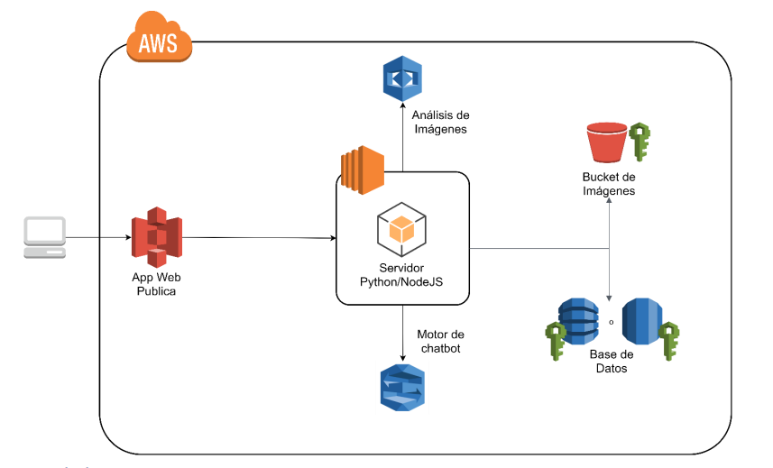

# Seminario 1 - Práctica 1 - Grupo #9


- [Datos](#Datos)     
- [Arquitectura](#Arquitectura)     
- [IAM](#IAM)     
- [Capturas](#Capturas)
  + [Buckets](#Buckets) 
    + [S3](#s3)
    + [python](#python)
  + [Database](#Database)
    + [Diagrama ER](#DiagramaER)  
    + [RDS](#RDS)     
  + [Web](#Web)     

- [Funciones](#funciones)
  + [Amazon Rekognition](#Rekognition) 
    + [Compare faces](#CompareFaces)
    + [Detect faces](#DetectFaces)
    + [Detect text](#DetectText)
    + [Detect labels](#DetectLabels)


<a name="Datos"/>

## Datos Estudiantes
- 201115018 - Joel Rodríguez Santos 
- 201800491 - Aracely Jacqueline Méndez González 
- 201800535 - Jessica Elizabeth Botón Pérez 
- 201801677 - Julio Emiliano Cifuentes Zabala 

<a name="Arquitectura"/>

## Descripción de la arquitectura

La arquitectura de la aplicacion es la siguiente




La aplicación web estará conformada por varios servicios de AWS, esto para poder tener una gran capacidad y escalabilidad.


### Servicios Utilizados

- AWS S3: Amazon Simple Storage Service es un servicio de almacenamiento de objetos, que ofrece escalabilidad, gran disponibilidad y seguridad. Se utilizaron dos buckets para esta aplicación. Uno dedicado al almacenamiento de las imágenes que suben los usuarios y otro para poder alojar el sitio web. 


- AWS EC2: Amazon Elastic Compute Cloud es un servicio que ofrece instancias de computo con las capacidades que se necesiten. Se utilizaron 2 instancias de EC2 para poder alojar los servidores de Python y Node.JS.

- AWS RDS: Amazon Relational Data Base Service es un servicio para configurar, operar y escalar bases de datos relacionales en la nube. Se utilizó una instancia de Postgres para almacenar la informacion de los usuarios de la aplicación.

- AWS Rekognition: es un servicio que proporciona funcionalidades de análisis y comparación de imagen y vídeo. Además, comparación y búsqueda de rostros altamente precisas. Puede detectar, analizar y comparar rostros para una amplia variedad de casos de uso, como la verificación de usuarios, catalogación, contabilización de personas y seguridad pública.

- Amazon Lex: es un servicio de inteligencia artificial (IA) completamente administrado con modelos avanzados de lenguaje natural que sirve para diseñar, crear, probar e implementar interfaces de conversación en las aplicaciones. Este servicio se utilizó para poder realizar el chatbot.

- Amazon Translate: Amazon Translate es un servicio de traducción automática neuronal que ofrece traducción de idiomas rentable, personalizable, de alta calidad y rápida. La traducción automática neuronal es una forma de automatización de traducciones entre idiomas que usa modelos de aprendizaje profundo para ofrecer traducciones más naturales y precisas que los algoritmos estadísticos tradicionales y de traducción basados en reglas.

<a name="IAM"/>


## Usuarios IAM utilizados


Para la elaboración del proyecto se utilizaron los siguientes usuarios junto con sus respectivas credenciles:

  - AdministradorBD: Usuario con permisos para la creación y gestión de instancias RDS. Pertenece al grupo BDService y también tiene credenciales en ELB.
  - AdministradorS3: Usuario con permiosos para la creación y gestión de buckets en S3. Pertenece al grupo S3Service.
  - Administrador_201800535: Usuario con permisos para la creación y gestión de instancias EC2. Pertenece al gurpo Administradores.
  - Administrador_201800491: Usuario con permisos para la creación y gestión de instancias EC2. Pertenece al gurpo Administradores.
  - Administrador_Rekognition: Usuario con permisos completos para el uso de todas las funcionalidades brindadas por amazon rekognition.
  - Administrador_Translate: Usuario con permisos completos para el uso de todas las funcionalidades brindadas por amazon translate.
  - Administrador_Lex: Usuario con permisos completos para el uso de todas las funcionalidades brindadas por amazon lex.

#### Politicas de los usuarios

- AdministradorBD
    - AWSElasticLoadBalancingServiceRolePolicy
    - AWSServiceRoleForRDS
    - AWSServiceRoleForSupport
    - AWSServiceRoleForTrustedAdvisor
    - CloudWatchFullAccess 
    
- Administrador S3
    - AmazonS3FullAccess 
    
- Administrador_201800535
    - AmazonS3FullAccess 
    - IAMUserChangePassword 
    - AmazonEC2FullAccess  
      
- Administrador_201800491  
    - AmazonS3FullAccess 
    - IAMUserChangePassword 
    - AmazonEC2FullAccess  

- Administrador_Rekognition
    - AmazonRekognitionFullAccess

- Administrador_Translate
    - TranslateFullAccess

- Administrador_Lex
    - AmazonLexFullAccess


<a name="Capturas"/>

## Capturas

<a name="Buckets"/>

## Buckets S3 y EC2

<a name="s3"/>


### S3 Imagenes

Bucket para el alojamiento de las imagenes


### S3 Sitio Web

La aplicacion web fue realizada con Angular.

Para poder realizar el despliegue de la aplicación se ingresó el siguiente comando.

```
ng build --proc
```

Este comando compila y crea un nuevo directorio llamado `dist` donde se encuentran los archivos de la pagina web.

Para poder alojar la pagina web primero se creo un bucket.


Luego se dejaron las configuraciones predeterminadas


Importante, quitar la seleccion para bloquear el acceso público. De esta manera nuestro bucket será público y podrá ser accedido para el alojamiento de la página web.


Luego de que creamos el bucket, es momento de subir los archivos que fueron generados por Angular, ubicados en su directorio `dist`


Luego en propiedades habilitamos la opcion de Alojamiento de sitios web estaticos


Por ultimo en "Permisos" agregamos la politica para que el bucket quede completamente publico

```json
{
    "Version": "2012-10-17",
    "Statement": [
        {
            "Sid": "PublicReadGetObject",
            "Effect": "Allow",
            "Principal": "*",
            "Action": "S3:GetObject",
            "Resource": "arn:aws:s3:::nombre/*"
        }
    ]
}
```


### EC2
Para crear la instancia es necesario ingresar en la pagina de AWS en el apartado de EC2 donde se selecciona la opcion de lanzar una nueva instancia. Luego permite elegir el sistema, el tipo de instancia y los detalles, despues se selecciona el grupo de seguridad al que se quiere pertenecer y si ya se tienen creados se selecciona sino se puede crear uno nuevo. Por ultimo se debe de revisar las configuraciones realizadas y se selecciona la opcion de lanzar donde se puede crear un par de llaves para el acceso a la misma.


<a name="python"/>

#### - Servidor Python


<a name="Database"/>

## RDS

Se utilizó el servicio de RDS de AWS para crear una base de datos de postgress 

<a name="RDS">

#### - Instancia RDS


<a name="DiagramaER"/>

#### - Diagrama ER


<a name="Web"/>

## S3 Aplicación Web

El sitio web se encuentra en la siguiente URL:

http://bucket-semi1-grupo9-paginaweb.s3-website-us-east-1.amazonaws.com/


### Login

Modulo de inicio de sesion. Es la primera ventana que se muestra de la aplicacion y en ella un usuario podra iniciar sesion o en caso de que no tenga un usuario registrado, se muestra la opcion de poder crear uno nuevo.


### Registro de Usuario

Formulario de registro para poder crear un nuevo usuario. 


### Inicio

Pagina principal que muestra la informacion del usuario y las diferentes opciones que puede ver en la aplicacion


### Ver Fotos

Opcion que mostrara todas las imagenes que tiene un usuario, clasifificadas por Album.


### Subir Foto

Modulo que permite al usuario subir una nueva foto, indicando el album en el que quiere agregarla.


### Configuracion de perfil

Modulo de configuracion para poder modificar los datos del usuario como su nombre de usuario, nombre completo e imagen. La contraseña no se podrá cambiar, y es necesario ingresarla para confirmar los cambios.


### Administrar albumes

Modulo para crear, modificar y eliminar albumes.


<a name="Funciones"/>


## FUNCIONES

<a name="Rekognition"/>


### AMAZON REKOGNITION

Para la elaboración del proyecto se llamaron a varios metodos del cliente de amazon (boto3) junto con sus respectivos parametros:

<a name="CompareFaces"/>

#### Compare_faces
Este metodo se utilizó para el inicio de sesion por cámara. Recibe 2 imagenes: la imagen recientemente tomada recibida desde el frontend en formato de base64 (para ser enviada debe decodificarse a bytes) y la imagen de perfil actual rescatada del bucket S3.  
De la respuesta obtenida, nos interesa la existencia de resultados en "FaceMatches", eso nos indica que los rostros coinciden lo necesario para identificarse como iguales y permitir el accesso al usuario.
```python
response = rekClient.compare_faces(
    SourceImage={"Bytes": decoded_image}, 
    TargetImage={"S3Object": { "Bucket": S3_BUCKE"Name": profilePhoto}}, 
    SimilarityThreshold=85.00
)

match = response['FaceMatches']
if len(match) == 0:
    return login  # 0

login = 1
```


<a name="DetectFaces"/>

#### Detect_faces
Este metodo se utilizó para la obtención de caracteristicas de la foto de perfil actual. Recibe la imagen de perfil actual rescatada del bucket S3 y el atributo como 'All' para asegurarnos de recibir toda la infomación.  
De la respuesta obtenida, nos interesa la existencia de resultados en "FaceDetails", eso nos indica que efectivamente es un rosto. De forma seguida debemos filtrar la información evitando apartados que no son relevantes y evaluando el estado (true/false) de las caracteristicas importantes.
```python
response = rekClient.detect_faces(
    Image={"S3Object": {"Bucket": S3_BUCKET, "Name": photo_url}},
    Attributes=['ALL']
)

facedetails = response['FaceDetails']
if len(facedetails) == 0:
    return "N/A"

avoidWords = ["BoundingBox", "Quality", "Pose", "Landmarks", "Confidence"]
specialWords = ["Emotions", "AgeRange", "Gender"]
d = facedetails[0]

for i in d:
  if i in avoidWords:
      continue
  if i not in specialWords:
      if d[i]["Value"] == True:
          labels = labels + i + ','
          continue
#endfor
```

<a name="DetectText"/>

#### Detect_text
Este metodo se utilizó para la obtención de texto en una foto. Recibe la imagen cargada desde el frontend en formato de base64 (para ser enviada debe decodificarse a bytes). 
De la respuesta obtenida, nos interesa la existencia de resultados en "TextDetections", eso nos indica que efectivamente hay texto. De forma seguida debemos extructurar la información anidando el texto detectado por linea.
```python
response = rekClient.detect_text(Image={"Bytes": decoded_image})

detect = response['TextDetections']
if len(detect) == 0:
    return textDetection

for i in detect:
    if i['Type'] == 'LINE':
        textDetection = textDetection + ' ' + i['DetectedText']
```

<a name="DetectLabels"/>

#### Detect_labels
Este metodo se utilizó para la obtención de caracteristicas/tags de la foto a subir. Recibe la imagen publicada rescatada del bucket S3, el máximo de tags a responser y el minimo de confianza para considerarse un tag como aceptado.  
De la respuesta obtenida, nos interesa la existencia de resultados en "Labels", eso nos indica que efectivamente se asignaron etiquetas. De forma seguida agregamos los tags obtenidos a un arreglo para realizar la creación/identificación de albumes y asignacion de fotos en los mismos. 
```python
response = rekClient.detect_labels(
    Image={"S3Object": {"Bucket": S3_BUCKET, "Name": photo_url}},
    MaxLabels=2,
    MinConfidence=85.00
)
lbs = response['Labels']
if len(lbs) == 0:
    return ""
            
for i in lbs:
    arrlabels.append(i['Name'])
```

